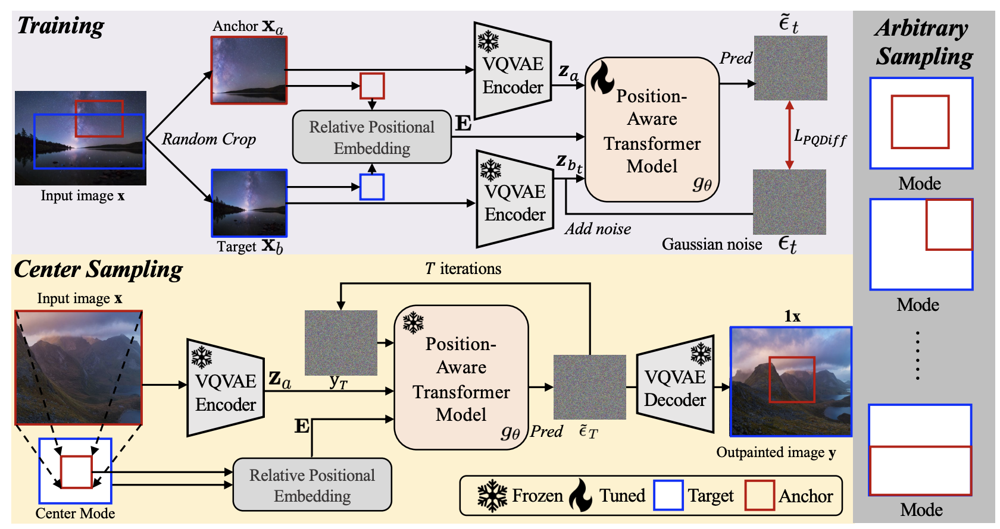
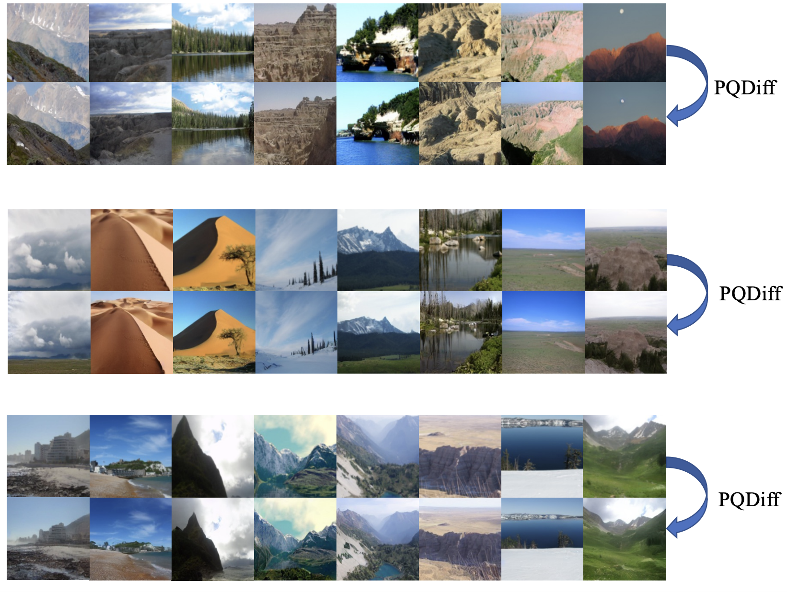

<h2 align="center"> <a href="https://arxiv.org/abs/2401.15652">[ICLR 2024🔥] Continuous-Multiple Image Outpainting in One-Step 

<a href="https://arxiv.org/abs/2401.15652">via Positional Query and A Diffusion-based Approach
</a></h2>
<h5 align="center"> If you like our project, please give us a star ⭐ on GitHub for the latest update.  </h2>

<h4 align="center">
Shaofeng Zhang<sup>1</sup>, Jinfa Huang<sup>2</sup>, Qiang Zhou<sup>3</sup>, Zhibin Wang<sup>3</sup>, Fan Wang<sup>4</sup>, Jiebo Luo<sup>2</sup>, Junchi Yan<sup>1,*</sup>

<sup>1</sup>Shanghai Jiao Tong University, <sup>2</sup>University of Rochester,  <sup>3</sup>INF Tech Co., Ltd., <sup>4</sup>Alibaba Group
</h4>

## 💡 Highlights

This paper proposes PQDiff, which learns the positional relationships and pixel information at the same time. Methodically, PQDiff can outpaint at any multiple in only one step, greatly increasing the applicability of image outpainting. 



## 🚀 Quick Start
### Dataset preparing

We use Flickr, Buildings, and WikiArt datasets, which can be obtained at [link](https://github.com/Kaiseem/QueryOTR).

### Training stage
```
accelerate launch --multi_gpu --num_processes 8 --mixed_precision fp16 train_ldm.py --config=configs/flickr192_large.py
```

You can train on your own dataset by modifying dataset/dataset.py

### Sampling stage

We provide the 2.25x, 5x, and 11.7x outpainting settings (with copy operation). Run:

```
python3 -m torch.distributed.launch --nproc_per_node=8 \
        --node_rank 0 \
        --master_addr=${MASTER_ADDR:-127.0.0.1} \
        --master_port=${MASTER_PORT:-46123} \
        evaluate.py --target_expansion 0.25 0.25 0.25 0.25 --eval_dir ./eval_dir/scenery/1x/ --size 128 \
                --config flickr192_large
```

You can outpaint images with arbitrary and continuous multiples by changing the `target_expansion` parameters. The four parameters mean (top, down, left, right).

### Evaluation stage

We provide scripts to evaluate inception scores, FID, and Centered PSNR scores in the `eval_dir`. Run:
```
python eval_dir/inception.py --path ./path1/
python -m pytorch_fid ./path1/ ./path2/
python eval_dir/psnr.py --original ./ori_dir/ --contrast ./gen_dir/
```

Here are some generated samples:



## 👍 Acknowledgement
* [QueryOTR](https://github.com/Kaiseem/QueryOTR). The codebase provides image outpainting datasets and a strong baseline.
* [PQCL](https://github.com/Sherrylone/PQCL). The codebase inspires the position query scheme in this work.


## 📑 Citation

Please consider citing 📑 our papers if our repository is helpful to your work, thanks sincerely!

```bibtex
@misc{zhang2024continuousmultiple,
      title={Continuous-Multiple Image Outpainting in One-Step via Positional Query and A Diffusion-based Approach}, 
      author={Shaofeng Zhang and Jinfa Huang and Qiang Zhou and Zhibin Wang and Fan Wang and Jiebo Luo and Junchi Yan},
      year={2024},
      eprint={2401.15652},
      archivePrefix={arXiv},
      primaryClass={cs.CV}
}
```
